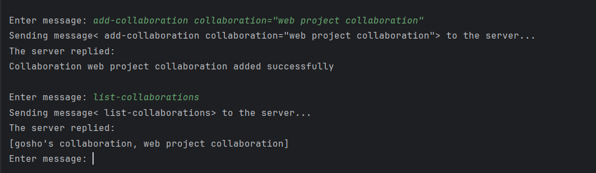

# Todoist

---
## General information
The idea of the project is to provide a java client which facilitates the process
of managing individual and group tasks. Tasks can be of any sort:
"to buy a dinner", "to feed the dog" or even to track the progress for university final exams or
manage the work progress in a group project where different tasks can have different assignees.

---
## Data schema
For data persistence the following files stored on the user's system are used:
* users.txt - stores credentials for the registered users
* individual tasks.txt - stores an individual user's task as well as the name of that user
  and the status of the task (finished or not finished)
* collaborations.txt - stores the name of a collaboration as well as the name of its owner
* collaboration regular users.txt - stores the name of a collaboration and its members
* collaboration tasks.txt - stores the name of a collaboration and the tasks related to it
* logger.txt - stores errors that occur during the execution of the program
  (e.g. when a client tries to perform not supported operation)

---
## Setup
### Steps
* Install JDK -> https://www.oracle.com/java/technologies/downloads/
* Clone the repo -> git clone https://github.com/Georgi-Topov/Todoist.git
* Open the project folder in your favourite IDE (e.g. IntelliJ IDEA)
* Run ServerMain
* Run ClientMain (can be done many times but make sure that you modify the run configuration to allow multiple instances)
* On the client console type: "help" to get used to the commands and their format

---
## Demo

